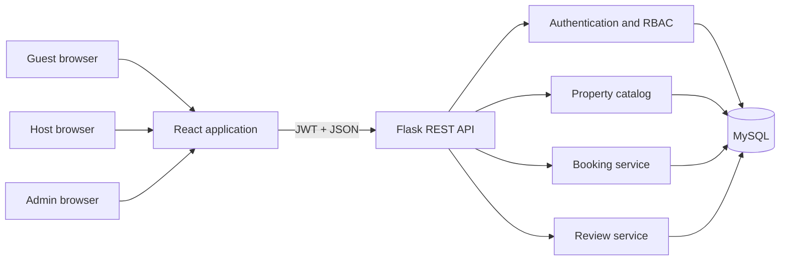

# Architecture

## System context

StayEase has three actors:

- **Guests** search for properties, create and cancel bookings, simulate payment, and review completed stays.
- **Hosts** publish properties, define availability, and manage reservations for their listings.
- **Administrators** monitor marketplace activity and resolve operational problems.

## Application boundaries



The API owns business rules. The browser never supplies trusted user identifiers or calculated prices. Authenticated identity comes from the token, and the server calculates nights and totals from database-backed availability.

## Critical booking invariant

For one property, two active bookings must never overlap:

```text
new_check_in < existing_check_out
AND new_check_out > existing_check_in
```

The booking transaction locks the selected property before checking existing reservations. This serializes competing booking attempts for that property and closes the race condition left by a plain `SELECT` followed by an `INSERT`.

## Security decisions

- Passwords are stored only as adaptive hashes.
- JWT signing material and database credentials come from environment variables.
- Authorization is role- and ownership-aware.
- Prices, totals, roles, and booking ownership are never trusted from browser input.
- Demo payment endpoints store no card data.

## Deployment posture

The project is designed to be completely demonstrable on a student laptop with Docker Compose. Public hosting is optional; screenshots, tests, API documentation, and a recorded demo remain valid portfolio evidence.
